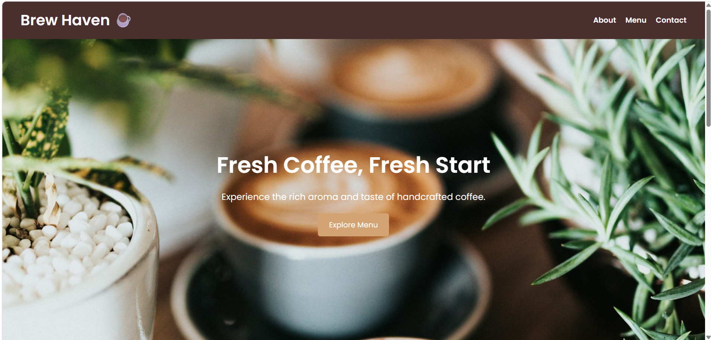
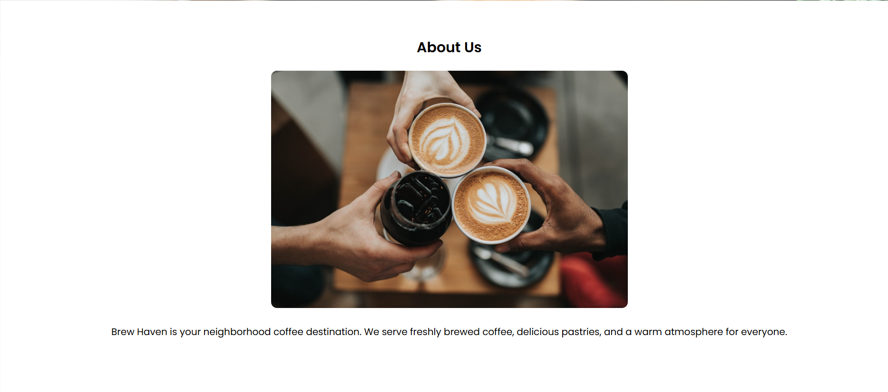
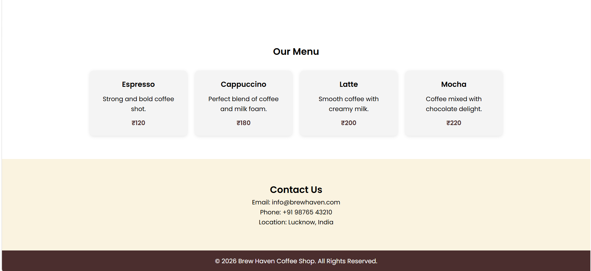

# DecodeLebs-internship
# ☕ Brew Haven Coffee Shop

A modern and clean Coffee Shop Landing Page built using HTML and CSS as part of the DecodeLabs Frontend Development Industrial Training Program.

## 📌 Project Overview

This project is a static webpage designed to showcase a coffee shop business. It focuses on creating a clean layout using HTML and CSS while following frontend development best practices.

## 🚀 Features

- Responsive navigation bar
- Hero section with background image
- About Us section
- Coffee menu section
- Contact section
- Footer
- Clean and modern design
- CSS styling and layout techniques

## 🛠️ Technologies Used

- HTML5
- CSS3
- Google Fonts (Poppins)

## 📂 Project Structure

```
project-folder/
│
├── index.html
├── style.css
└── README.md
```

## 📸 Screenshot





## 🎯 Learning Outcomes

Through this project, I learned:

- HTML page structure
- Semantic elements
- CSS styling
- Flexbox layout
- Navigation design
- Creating static web pages

## 📋 Project Requirements Covered

- Proper HTML structure
- Headings and sections
- Images
- CSS styling
- Clean and readable layout

## 👨‍💻 Author

Mital K. Mistry

Frontend Development Intern  
DecodeLabs Industrial Training Program

## 📄 License

This project is created for educational and internship purposes.